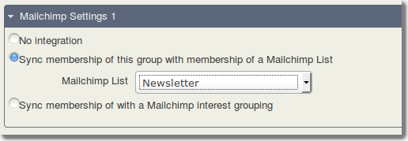
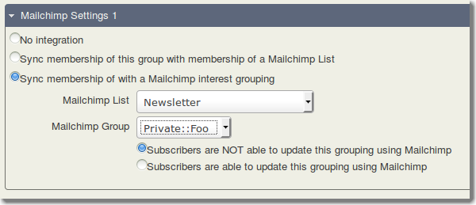

uk.co.vedaconsulting.mailchimp
==============================

The new extension builds on the existing work done by the science gallery, adding the ability to pick the Mailchimp List the CiviCRM group should be integrated to as well as making the entire process a much simpler one to setup.

For each Mailchimp list that you want to integrate, you set up a CiviCRM group.
This will control the subscribers in that list. Add contacts to the group in
CiviCRM and after pushing the sync button, those will be subscribed to your Mailchimp
list. If you remove contacts from the group in CiviCRM, the sync will unsubscribe
them at Mailchimp. If anyone clicks an unsubscribe link in a Mailchimp email,
they are automatically removed from your CiviCRM group.

Additionally, if you use Mailchimp's "Interest Groupings", you can map particular
Mailchimp groups to a CiviCRM group. You can choose whether this is a group that the
subscriber can edit (using Mailchimp's forms), or not.

So if you have a list of fundraisers you might use an interest grouping called
"Interests" and give subscribers options like "Shaking tins", "Door knocking",
"Climbing mountains".  Each of these can be mapped to a CiviCRM group (if you
so choose) and membership of these groups will be updated.

Alternatively, what if you have groups in CiviCRM like "major donor" or
"miserly meanie" that you want to use to segment your mailings but you don't
want subscribers seeing or being able to edit these? This is accommodated, too.
It's up to you to set up your Mailchimp Interest Groupings so that this fieldset
is hidden from subscribers, but then you can just link a CiviCRM group to
one of those. These groups will never update from Mailchimp to CiviCRM.

NB Mailchimp sometimes calls Interest Groupings just "Groups", which gets
very confusing because you have Groups of Groups, and of course CiviCRM uses
the word Group, too! Here I will stick to calling the Mailchimp fields
"Interest Groupings" which each contain a number of "Mailchimp Groups", to
differentiate them from CiviCRM groups.

## How to Install

1. Download extension from https://github.com/veda-consulting/uk.co.vedaconsulting.mailchimp/releases/latest.
2. Unzip / untar the package and place it in your configured extensions directory.
3. When you reload the Manage Extensions page the new “Mailchimp” extension should be listed with an Install link.
4. Proceed with install.

Before the extension can be used you must set up your API keys...

To get your accounts API you should follow these instructions http://kb.mailchimp.com/accounts/management/about-api-keys

Once you’ve setup your Mailchimp API key it can be added to CiviCRM through "Mailings >> Mailchimp Settings" screen, with url https://<<your_site>>/civicrm/mailchimp/settings?reset=1. Using “Save & Test” button will test that a connection can be made to your Mailchimp account, and if your API settings are correct.

## Basic Use

In Mailchimp: Set up an empty list, lets call it Newsletter. You'll also need
to set up this list's **Webhooks**.

Steps to configure Mailchimp Webhook settings with the relevant CiviCRM Url:  
1. To know the relevant CiviCRM url visit https://<<your_site>>/civicrm/mailchimp/settings?reset=1.  
2. In the “Security Key” field entering a key shows the complete webhook url. Note down the complete url.  
3. Make sure webhook url is accessible to public. If not, just make sure anonymous / public user has “allow webhook posts” permission.
4. Log in to your MailChimp account.  
5. Navigate to your Lists.  
6. Click Webhooks under Settings menu and Click ‘Add a New Webhook’ button.  
7. Enter the CiviCRM Webhook URL, noted in #2 ( https://<<your_site>>/civicrm/mailchimp/webhook?reset=1&key=ABCD ) in Callback URL field.  
8. Tick the relevant options for type of updates and when to send an update.  
9. Click Save.      

In CiviCRM: you need a group to track subscribers to your Mailchimp Newsletter
List. You can create a new blank group, or choose an existing group (or smart
group). The CiviCRM Group's settings page has an additional fieldset called
Mailchimp.

Choose the integration option, called "Sync membership of this group with membership of a Mailchimp List" then choose your list name.

Save your group's settings.

The next step is to get CiviCRM and Mailchimp in sync. **Which way you do this
is important**. In our example we have assumed a new, blank Mailchimp list and
a populated CiviCRM Group. So we want to do a **CiviCRM to Mailchimp** Sync.
However, if we had set up an empty group in CiviCRM for a pre-existing
Mailchimp list, we would want to do a **Mailchimp to CiviCRM** sync. If you get
it wrong you'll end up removing/unsubscribing everyone!

So for our example, with an empty Mailchimp list and a CiviCRM newsletter group
with contacts in, you'll find the **CiviCRM to Mailchimp Sync** function in the
**Mailings** menu.

Push the Sync button and after a while (for a large
list/group) you should see a summary screen.

### From here on...

Any un/subscribes from the Mailchimp end will be handled (almost) instantly
using the webhook. Changes at the CiviCRM end will also be handled (almost) instantly using CiviCRM database post hook.

### Important note about unsubscribed contacts

Note: If anybody is added/removed to group in civiCRM, they get subscribed/unsubscribed to Mailchimp immediately.
If Webhook is set properly in Mailchimp, then subscribe/unsubscribe in Mailchimp is treated back to civiCRM
immediately as addition/deletion to group

We have an upcoming feature that will give you the option to force
a CiviCRM to Mailchimp sync which will automatically do the necessary deletions,
but this is not included in the current version. Watch this space.

## Interest groupings

For this example we'll set up two interest groupings in Mailchimp, one called
Interests that publically viewable, and one called Private that is hidden from
subscribers. Within "Interests" add Mailchimp Groups such as "bananas",
"organic farming", "climate change activism". Within the "Private" Mailchimp
Interest Grouping, you might add Mailchimp Groups called "major donor", "VIPs"
etc.

Please take care and follow Mailchimp's help pages for how to restrict the
visibility of the Private interest grouping.

Now back in CiviCRM, setup groups to map to these Mailchimp Groups. When you
look at the CiviCRM group's settings page, choose "Sync membership with a
Mailchimp interest grouping" you'll then see something like:

Here you can see the two options about whether Mailchimp subscribers are supposed
to be able to edit their membership of this interest grouping.

So for the Private interest grouping, choose the first, No option, for the
public "Interests" one, choose the second option.

**Please note** that while it's possible to configure one Mailchimp Group to be
updatable and another to be non-updatable within the same mailchimp interest
grouping, this will lead to unpredictable results. Stick to the rule: if it's
public, it should be updateable, if it's hidden/private, it should be not
updatable.

When you run the sync, these grouping will be updated accordingly. Nb. a webhook
immediately processes changes made from the Mailchimp end.

## Sync - which way?

If you are integrating Mailchimp account that's been there for a while (lots of contacts), with a relatively new CiviCRM setup (less or no contacts), might want to do mailchimp to civicrm sync first (aka pull). Any updates to Mailchimp after that would immediately be handled via webhooks. And updates to CiviCRM could be passed onto Mailchimp via Civi to Mailchimp Sync.

In other words, most Mailchimp changes are handled immediately via webhook. So it is now rare to need the Mailchimp to CiviCRM sync operation, whereas the CiviCRM to Mailchimp sync should become part of your pre-campaign sending preparation.

In any case sync process between CiviCRM and Mailchimp can be automated and run on regular basis using the “Mailchimp Sync” scheduled job shipped by extension. The job can be enabled and configured from the Scheduled Job screen: Administer > System Settings > Scheduled Jobs. 

Version 1.5 and above also ships a scheduled job for "Mailchimp Sync".

**Note: Before you do any sync make sure to backup your mailchimp and civicrm contacts.**  
